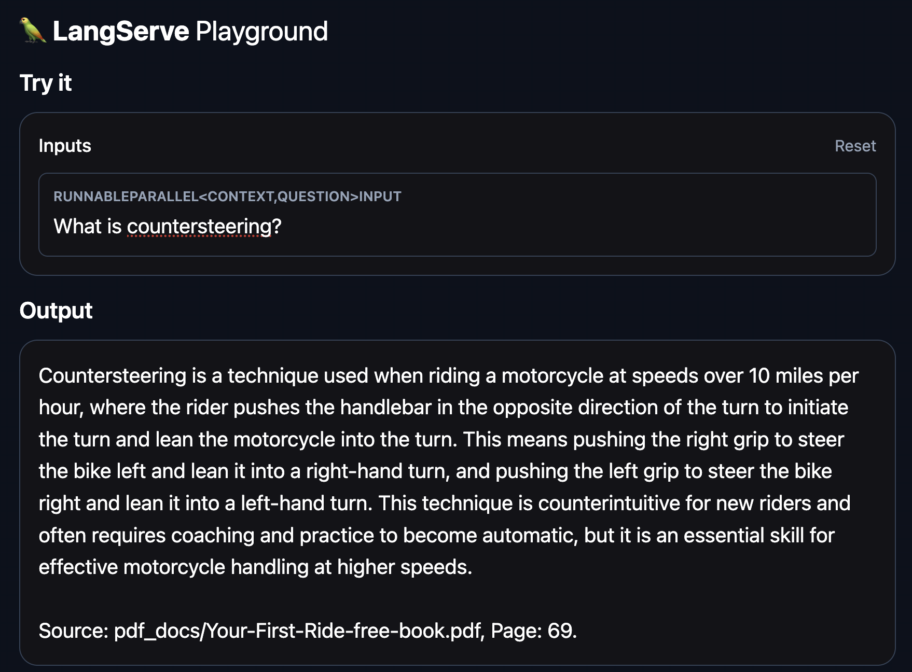
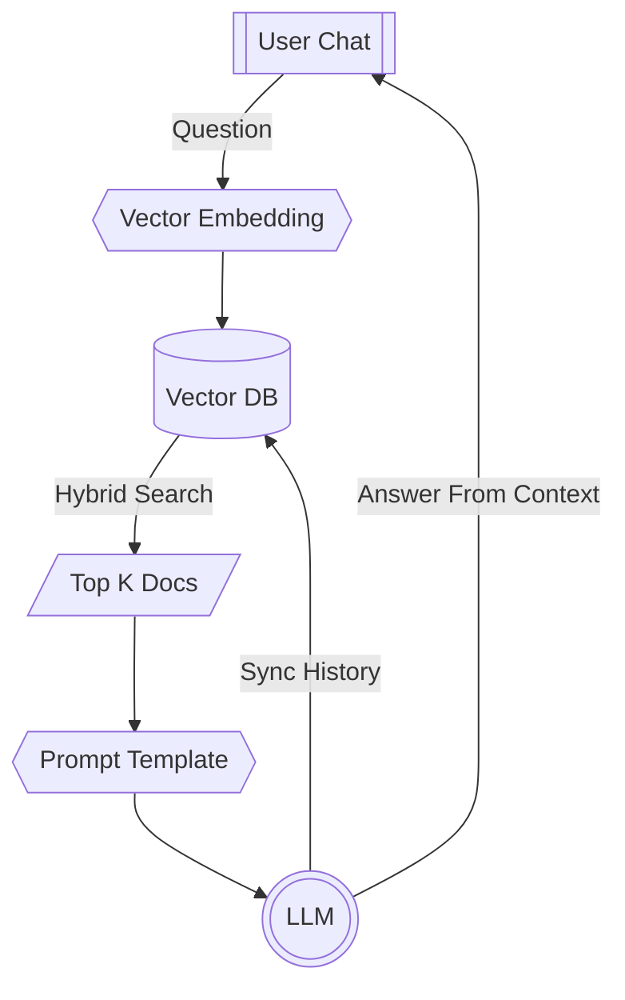
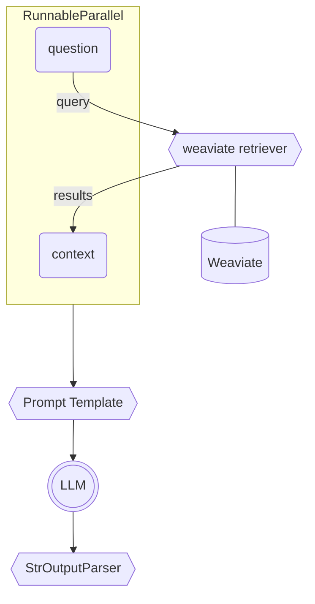

# Langchain Development Environment
**Langchain** is a powerful framework for building intellegent applications with LLMs.  This repo is a very simple starting point for hacking and tinkering with Langchain, all packaged up nicely in Docker Compose, just *bring your own OpenAI API key*.

Please see [Basic Concepts](#basic-concepts) if you are new to Langchain and building apps with LLMs.

**Table of Contents:**  
- [Install](#install)  
- [Add PDFs](#add-pdfs-to-the-vector-db)  
- [Start The Env](#start-up-the-environment)  
- [Vectors](#vectors)  
- [RAG](#rag)  
- [RAG In Langchain](#rag-in-langchain)


> :warning: :construction: **This repository is expermental and incomplete**: This code can help you get started hacking and exploring with Langchain, but is not a production-ready system.  All the normal caveats apply.  

## Install
Before installing, make sure you already have [Docker Desktop](https://www.docker.com/products/docker-desktop/) installed and running.

Use the helper script to build the proper Docker images
```console
$ ./dev.sh install
```
> :warning: This step will ask for your Open AI API key, storing it in a .env file in the root directory of the project.

## Add PDFs to the Vector DB
Add PDFs you want to use for RAG to the `/demo_app/pdf_docs/` directory.

Use the helper script to open up a terminal in a Langchain container, and start a ipython session.
```console
$ ./dev.sh terminal
root@f1fe6d38f3d2:/app/demo_app# ipython
```
```ipython
In [1]: from common.utils import add_pdfs_to_kb
In [2]: from basic_rag.retrievers import PDFDocuments
In [3]: add_pdfs_to_kb("./pdf_docs/", PDFDocuments)
Loaded pdfs at ./pdf_docs/ into vector store
```

## Start Up the Environment
Use the helper script to start the Docker Compose environment
```console
$ ./dev.sh start
```

Open a browser to the basic rag playground
http://localhost:8000/basic-rag/playground/




## Basic concepts
Mechanically speaking, LLMs are **next token generators**.  In other words, given some text, an LLM, via advanced neural networks, can predict the next probable word, or token.

The results are often remarkable and human like, which has lead to the explosive popularity of ChatGPT and GenAI in general.  With frameworks like Langchain, we can hook into these capabilities and use them in our code, extending the features of our application with GenAI automation.

It's important to remember that the LLM is not performing any logic or reasoning, and relying on the LLM for making decisions is a poor use of the current technology.  However, we can distill cognitive tasks to Langchain chains, and *do the thinking for the LLM* - holding the hand of the LLM through the logic.

---

### Vectors
>**What are vector embeddings?**    
>Vectors are floating point numbers assigned to the words - or tokens - in text.  If we represent the English vocabulary as a 3-dimensional cube, vectors would act as the addresses of the words, or tokens, in that cube.  

When developing LLM applications, text is frequently sent to AI endpoints that are purpose built to turn text into vectors.  These vectors can be saved to a vector database, or can be used to search the vector database for text that is similar.

For more information, please see the **[OpenAI page on vector embeddings](https://platform.openai.com/docs/guides/embeddings)**.

>**What are vector databases?**  
>A vector datbase stores and indexes text and meta-data, along with the vectorized representaion of the text.  This vectorization allows for powerful search capabilities.

---

### RAG
**RAG** (*Retrieval Augmented Generation*) is a technique used to give a LLM memory, and control the data an LLM has access to.  This leads to more grounded and acurate responses, reduces hallucinations, and allows for the training of domain specific chat bots.

Imagine a prompt template like below:
```
Answer the question based only on the following context:
{context}

Make sure when answering to provide the unique source links as citations in the format of: "Source: <location>, Page: <page number>".
Question: {question}
```
In Langchain, we can use a retriever to query our vector database for text that is similar to the user's `{question}` and include that data in the prompt as its `{context}`

When using RAG, we will instruct our vector database to return a number (the `topk`) of the documents that are the closest match.  This text is then used in the prompt template as the `{context}`



---

### RAG In Langchain
Langchain features runnable classes that allow functional *chaining* of logical steps. A brief overview of the main components that will make up our [LCEL](https://python.langchain.com/docs/expression_language/) chain:

#### Loaders 
Langchain includes many helper functions and clasees to faciliate loading data into *Document* objects.  In this repo, included are implementation examples with the **WebBaseLoader**, which loads content from a url, and the **PyPDFDirectoryLoader** which loads data from a directory containing PDF files.

#### Retrievers
Langchain retrievers are used to retrieve data from document stores.  In this repo, included in this repo is an implementation of a custom retriever for the [Weaviate](https://weaviate.io/) vector database.  


